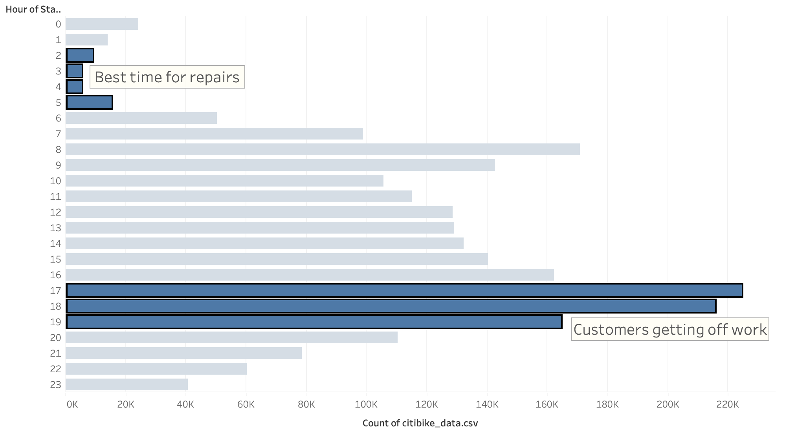
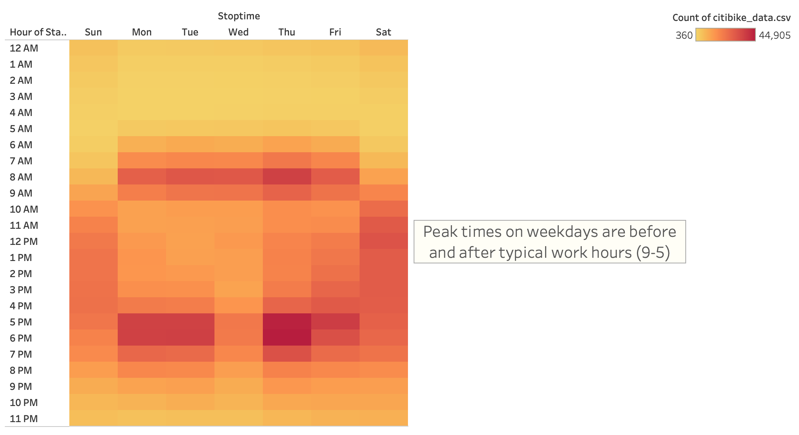
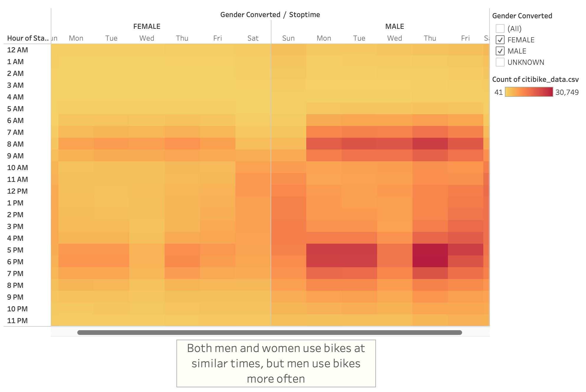
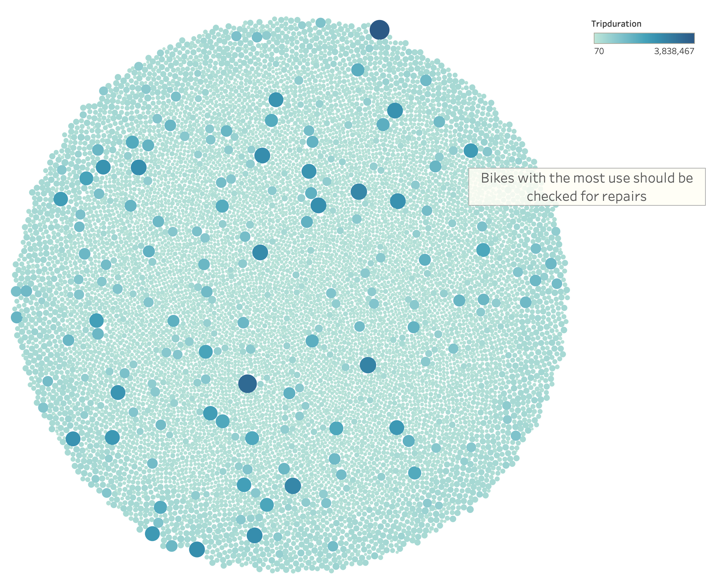
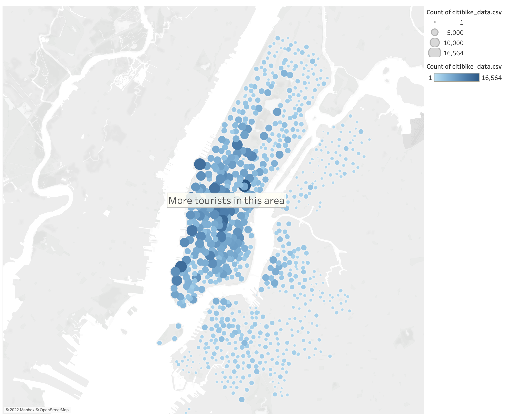
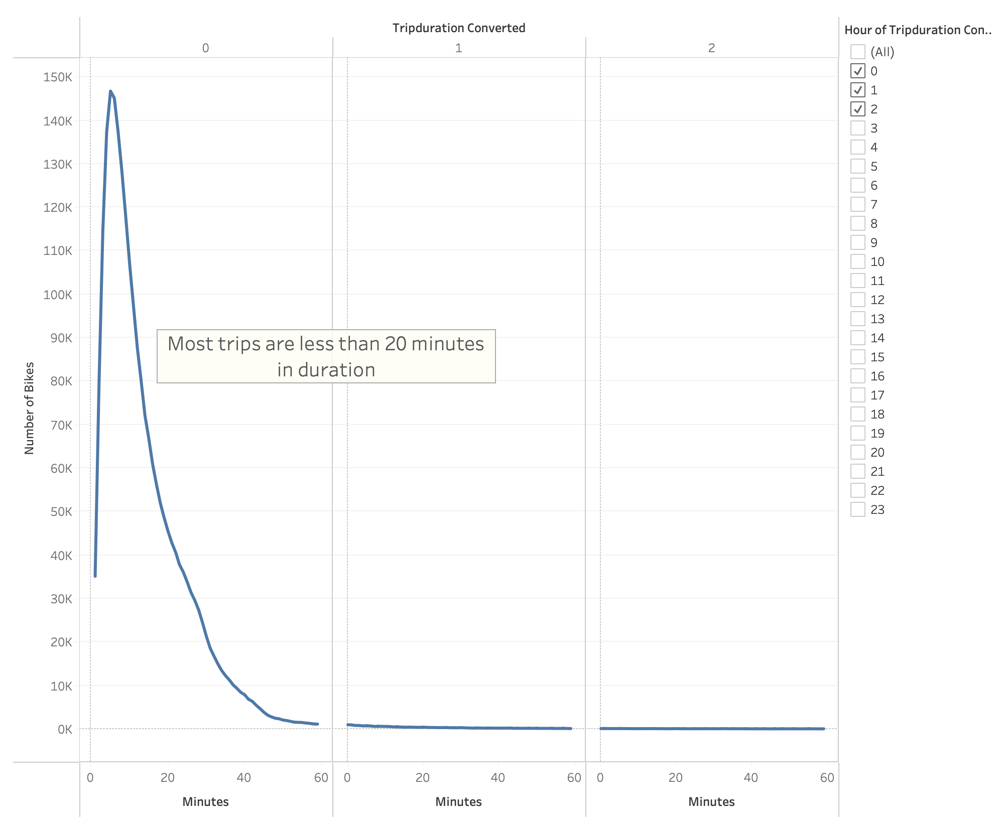
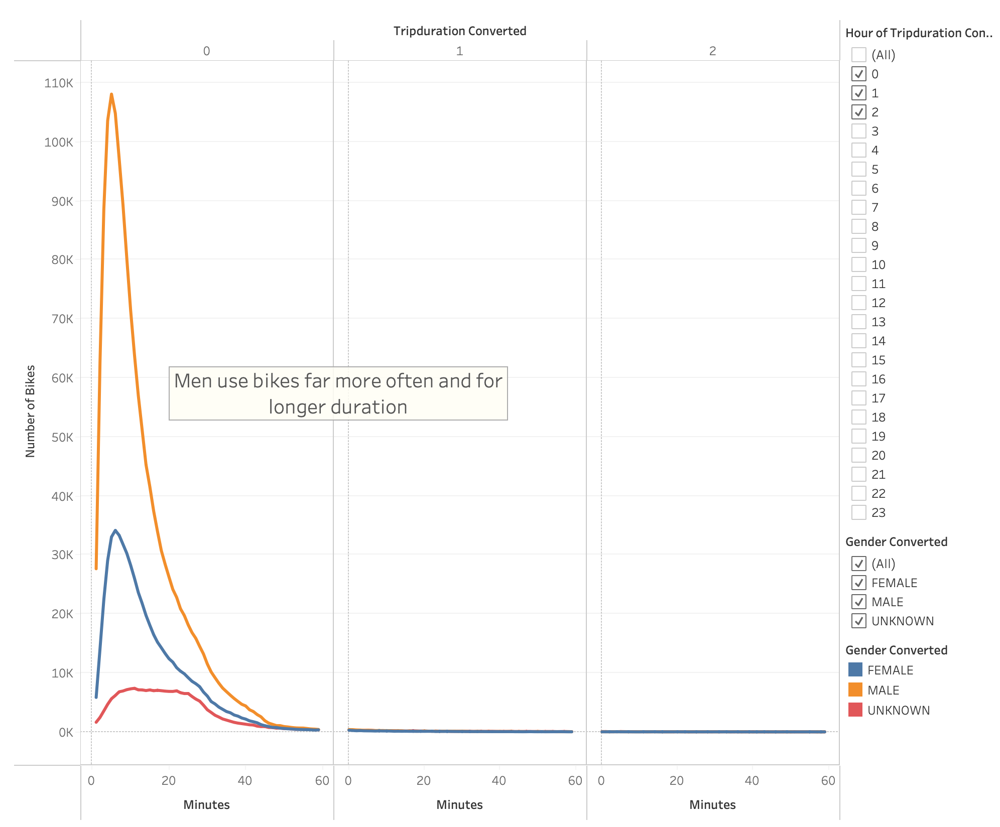
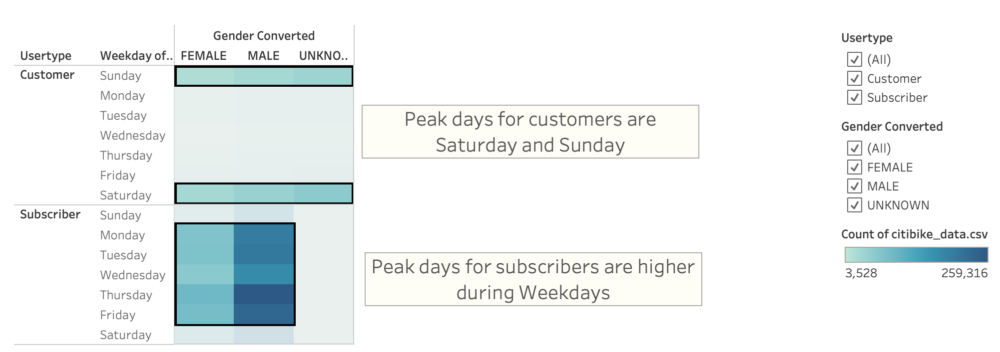

# Bike-sharing with Tableau

## Project Overview

In order to convince investors that a bike-sharing program in Des Moines is a sound business venture, a bike trip analysis will need to be performed. The analysis should include a modified dataset that converts the trip duration data into a standard datetime format, at least seven different visualizations, and lastly a Tableau story along with a written analysis.

## Resources

- Software: Visual Studio Code 1.68.1, Tableau Public 2022.1.2
- Languages: Python 3.9.7
- Tableau Story Link: [CLICK HERE](https://public.tableau.com/app/profile/zack.valis/viz/Module14ChallengeStory_16563786260780/NYCCitiBike)

## Results

The least busy hours of the day are the best to service any bikes that need it. In this case, 2-5am would be the ideal time to perform repairs. Conversly, between the hours of 5-9pm, we would want as many bikes available due to being peak use times.

We can see clearly here that peak usage times are typically before and after normal working hours (9am-5pm) except for Saturday and Sunday where people are using the bikes more consistently throughout the day.

Female bike usage appears to be much lower than their counterparts, while hours of usage is roughly the same.

As seen in this visualization, most bikes are similar in overall usage. Bikes with high usage should be inspected and repaired or retired as needed.

In this graph of Manhattan, the top starting locations are in Midtown. For Des Moines, the largest concentration of bikes should be in the most trafficked areas.

Most trip durations appear to be 20 minutes or less. Bike stops should be situated accordingly so customers don't have to go too far out of their way to stop using a bike.

One can see that men use bikes far more than women and also use them for longer durations as well.

Customers typially use bikes most often on Saturdays and Sundays. It is likely that many of these customers are tourists visting for a limited time, whereas annual subscribers are using the bikes more often throughout the week, likely to commute with.

The full Tableau story can be found in the Resources section above.

## Summary
In summary, it is important to market the services to women as overall usage is much lower than men, bike maintenence should be performed during the least busy hours of service, and bike starting/stopping locations should be strategically placed with typical trip duration in mind.

Two suggested visualizations to add in order to further this analysis could include a map showing top ending locations, that way the starting and ending locations can be more closely compared, as well as a visualization for the average trip duration comparing customers and subscribers.
